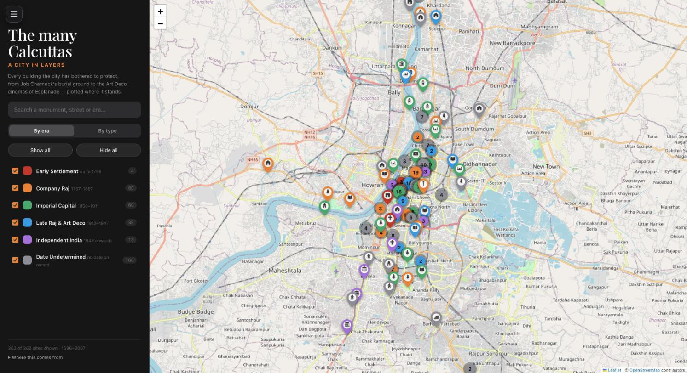

# The Many Calcuttas — a city in layers

An interactive map of the heritage of Kolkata and its suburbs: 362 sites, each
plotted where it stands and coloured by the era that built it.



Inspired by [delhi-monuments](https://github.com/kaustubh-misra/delhi-monuments).
Delhi's story is told through eighteen dynasties; Kolkata is a much younger city,
so this one is told through six phases of a single city's life — from Job
Charnock's burial ground to the Art Deco cinemas of Esplanade.

## Running it

It is a static site with no build step, but the JSON is loaded with `fetch`, so
it has to be served over HTTP rather than opened from the filesystem:

```sh
python3 -m http.server 8000
# then open http://localhost:8000
```

Deploy by pushing the repository root to GitHub Pages, Netlify or any static
host. If you do, set `og:image` in `index.html` to the absolute URL of
`preview.jpg` — relative Open Graph images are not resolved by most crawlers.

## What's on the map

| | |
|---|---|
| Sites | 362 |
| With a construction date | 196 |
| With a photograph | 278 |
| With a street address | 285 |
| With a further-reading link | 69 |
| Coverage | ~25 km from Lal Dighi, plus Achipur at 27 km |

Two ways to slice it, switched in the sidebar:

- **By era** — Early Settlement (to 1756), Company Raj (1757–1857), Imperial
  Capital (1858–1911), Late Raj & Art Deco (1912–1947), Independent India
  (1948–), and everything nobody recorded a date for.
- **By type** — sixteen categories, from *Temple & Thakurbari* to
  *Bridge, Tower & Public Works*.

The pin's colour follows whichever grouping is active; the glyph inside it
always says what the building is.

### On further reading

39 sites link to a post on Deepanjan Ghosh's blog, which is the best sustained
piece of writing on Kolkata's buildings anywhere online. The links are taken
from his own categorised [heritage index](https://double-dolphin.blogspot.com/p/blog-page_27.html),
which names 79 buildings, and every one was checked by hand before it went into
`scripts/blog_links.json`. Title similarity alone is not enough: the blog also
has posts on the Victoria Memorial in *Lucknow*, on Gillander House on *Clive
Street*, and on the Small Causes Court on *Bankshall Street*, none of which are
the monuments whose names they resemble. `blog_index.py` re-fetches the feed and
prints candidates for review; it never adds them itself.

### On dates

196 of 362 sites carry a year. The rest sit in **Date Undetermined**, and that
is deliberate: the KMC register does not record construction dates, and for most
of the smaller listed houses no published source gives one. Rather than guess,
they are shown as undated. Every date that *is* shown came from a Wikidata
inception claim, an explicit statement in the cited Wikipedia article, or a
hand-checked correction in `scripts/overrides.json`.

## Rebuilding the dataset

```sh
cd scripts
python3 -m venv .venv && ./.venv/bin/pip install pdfplumber
./.venv/bin/python fetch_sources.py      # downloads into scripts/cache/
./.venv/bin/python build_data.py         # writes ../monuments.json and ../eras.json
```

| File | |
|---|---|
| `fetch_sources.py` | Downloads the SPARQL results, the KMC PDF and the Wikipedia extracts into `scripts/cache/` |
| `kmc_register.py` | Parses the PDF. It has no ruling lines and its cells are vertically centred, so rows are rebuilt by anchoring on the ward number and assigning each word to its nearest anchor |
| `blog_index.py` | Fetches the blog's post index and proposes further-reading candidates for review |
| `blog_links.json` | The reviewed monument → blog post links |
| `build_data.py` | Merges the sources, picks a date, derives era and category, writes the JSON |
| `curated_landmarks.txt` | Landmarks added by hand, one per line |
| `overrides.json` | Hand-checked corrections to dates, categories and descriptions |
| `manual_sites.json` | Sites added by hand, each recording where its coordinate came from |

## Layout

```
index.html        markup and metadata
styles.css        dark sidebar, info card, responsive layout
app.js            Leaflet map, clustering, layers, search, info card
monuments.json    the dataset
eras.json         era definitions used for the layer list
scripts/          the data pipeline
```

Built with [Leaflet](https://leafletjs.com/),
[Leaflet.markercluster](https://github.com/Leaflet/Leaflet.markercluster) and
[Fuse.js](https://fusejs.io/), over OpenStreetMap tiles. No API keys, no build
step, no framework.

## Licence and credit

Map data © OpenStreetMap contributors. Descriptions are from English Wikipedia
(CC BY-SA 4.0); photographs are from Wikimedia Commons under their individual
licences, linked from each site's Wikidata record. The KMC graded list is a
public document of the Kolkata Municipal Corporation. Further-reading links
point to posts by Deepanjan Ghosh at double-dolphin.blogspot.com; only their
titles and URLs are reproduced here.
